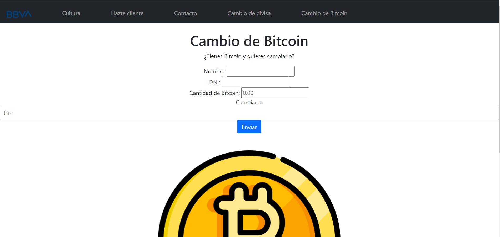
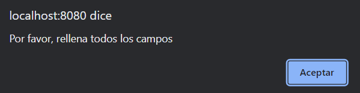
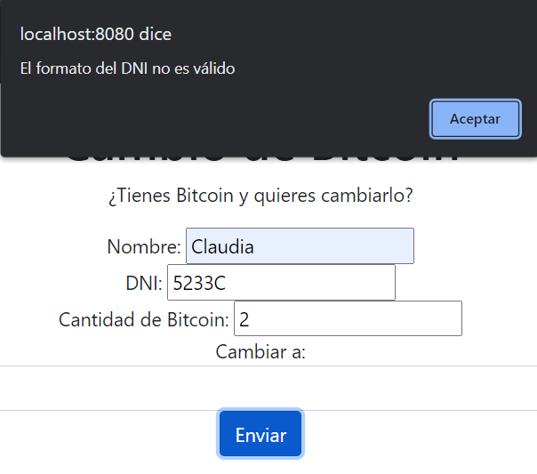
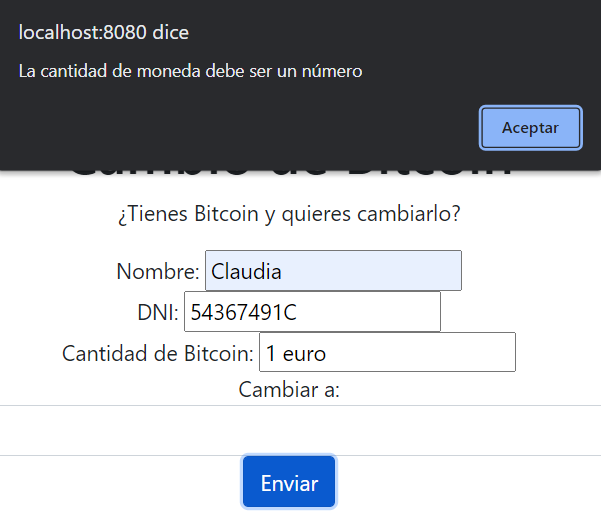

# PRÁCTICA 5 - PAT
## Claudia Blanco 3ºA
###### Página de BBVA. HTML. CSS. Bootstrap. Javascript. Spring Boot.

Se ha ampliado la página creada a lo largo de las prácticas anteriores añadiendo una nueva sección (ver bitcoin.html).

##### Desarrollo y descripción de las funcionalidades añadidas a la práctica

-En esta sección el usuario puede introducir en un formulario una cantidad de Bitcoin y obtener su equivalente en otro tipo de moneda

-Se ha utilizado una nueva API de cambios de moneda (diferente a la de la práctica anterior usada en cambiosdemoneda.html) que incluye entradas
para criptomonedas, divisas normales y commodities. El link a dicha API (gratuita y sin clave) es: https://api.coingecko.com/api/v3/exchange_rates
<a href="https://api.coingecko.com/api/v3/exchange_rates" target="_blank">API</a>

-Las clases de Java desarrolladas para Spring Boot son:
    -Clase de configuración: ExchangeRateConfiguration.java
    -Controller: ExchangeController.java
    -Service: ExchangeRateService.java (interface) y la clase que lo implementa, ExchangeRateServiceImpl.java

-Para mostrar los resultados en HTML (bitcoin.html), se ha usado un archivo Javascript (prueba.js), que hace la validación del formulario y sus campos

-Las dependencias de Spring Boot descargadas a través del Initializr son: Spring Web, Lombok y Validation

-Se han utilizado, entre otras:
    -RestTemplate
    -JSonIgnoreProperties
    -Bean
    -Autowired

##### Gestión de errores
En el JS del formulario se hacen una serie de comprobaciones (formato del DNI correcto, campos completos, cantidad de Bitcoin es un número y no un String...)
Además, se hace un fetch("/exchange"), del cual se encargan las clases de Spring, y se comprueba si el status del resultado es 200 (todo ha ido bien) o no

La nueva sección es la siguiente:

Si se intenta dar a enviar sin rellenar los campos, aparece la siguiente alerta:

Si se introduce un DNI con formato incorrecto, aparece otra alerta:

Por último, si se introduce un valor no válido de cantidad de Bitcoin:

Además, si la petición (fetch) a la API no va bien (por ejemplo, si no está levantado el servidor):

Link a través de GitPod:

Para que se ejecute todo correctamente, se debe poner el el buscador: localhost8080
